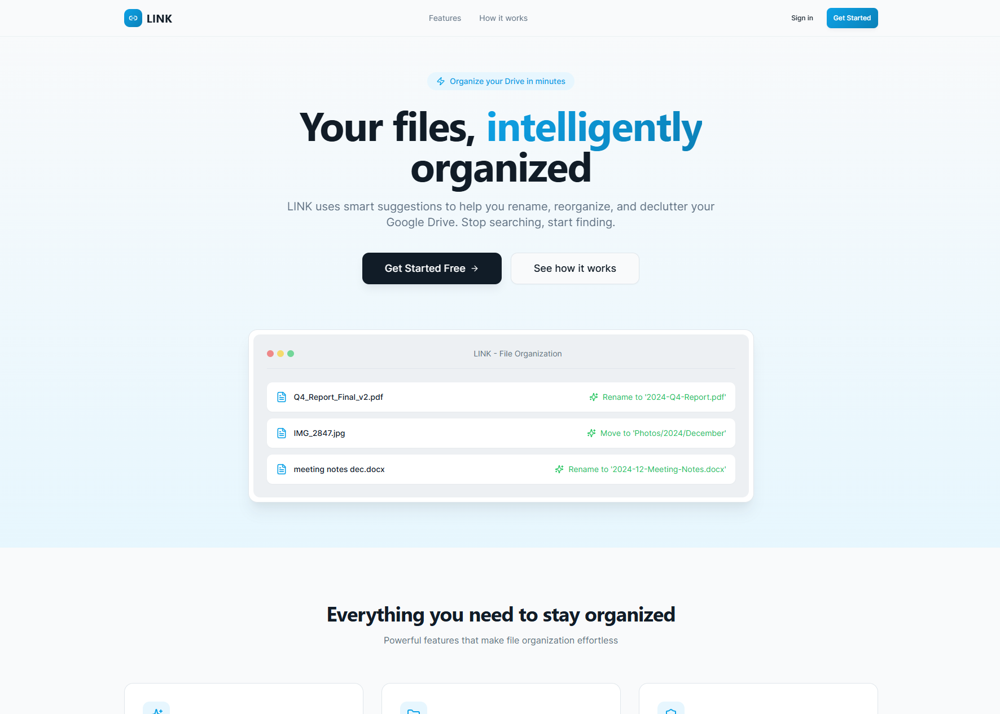

# Link AI Prototype

## Project Overview

Link AI is a full-stack application that enhances Google Drive with intelligent, AI-powered file organization.

It allows users to securely connect their Google Drive, analyze their file structure, and receive actionable suggestions such as renaming files, grouping by type, and improving folder organization.

The project was created to address a common problem: unstructured and cluttered cloud storage. As files accumulate over time, users often lose track of content, resulting in inefficiency and poor productivity. Link AI introduces a smarter, automated way to maintain a clean and scalable file system.

At its core, the platform combines Google Drive integration, rule-based analysis, and AI-driven suggestions to deliver a seamless organization experience.


## Usage





### User Flow

**1.** Open the app in your browser

**2.** Click “Connect with Google”

**3.** Authenticate via Google OAuth

**4.** Browse your Google Drive files

**5.** View AI-generated suggestions for organizing content

**6.** Adjust rules and preferences in the settings page

## Features

🔐 **Authentication** - Google OAuth 2.0 Authentication

📂 **Real Data** - Real-time Google Drive file access

🤖 **AI Suggestions** - AI-powered organization suggestions

⚙️ **Settings Management** - Customizable rules and settings

🔄 **Session Management** - Session-based authentication (secure cookies)

🧠 **Real Engine** - Intelligent file analysis engine

✅ **Error Handling** - Graceful fallbacks to demo data 

## Technologies Used

This project is built with:

**Frontend:**
- Vite
- TypeScript
- React
- shadcn-ui
- Tailwind CSS

**Backend:**
- Node.js/Express
- Google Drive API
- Session-based Authentication

## Installation

**Prerequisites**

- Node.js (v16+ recommended)
- npm or bun
- Google Cloud Project with OAuth credentials


## Setup Instructions

### Backend
```bash
cd backend
npm install

# Create .env file:
# PORT=5000
# FRONTEND_URL=http://localhost:5173
# GOOGLE_CLIENT_ID=your_client_id
# GOOGLE_CLIENT_SECRET=your_client_secret
# REDIRECT_URL=http://localhost:5000/api/auth/google/callback

npm run dev
```

### Frontend
```bash
cd frontend
npm install (or bun install)

# Create .env.local file:
# VITE_BACKEND_URL=http://localhost:5000

npm run dev (or bun dev)
```

---

## Development

### How to Edit This Code

**Use your preferred IDE**

If you want to work locally using your own IDE, you can clone this repo and push changes.

The only requirement is having Node.js & npm installed - [install with nvm](https://github.com/nvm-sh/nvm#installing-and-updating)

Follow these steps:

```sh
# Step 1: Clone the repository using the project's Git URL.
git clone <YOUR_GIT_URL>

# Step 2: Navigate to the project directory.
cd <YOUR_PROJECT_NAME>

# Step 3: Install the necessary dependencies.
npm i

# Step 4: Start the development server with auto-reloading and an instant preview.
npm run dev
```

**Edit a file directly in GitHub**

- Navigate to the desired file(s).
- Click the "Edit" button (pencil icon) at the top right of the file view.
- Make your changes and commit the changes.

**Use GitHub Codespaces**

- Navigate to the main page of your repository.
- Click on the "Code" button (green button) near the top right.
- Select the "Codespaces" tab.
- Click on "New codespace" to launch a new Codespace environment.
- Edit files directly within the Codespace and commit and push your changes once you're done.


## License

This project is licensed under the MIT License.
See the LICENSE file for more details.

---

## Notes

- Session cookies are automatically included in all API requests via `credentials: "include"`
- Backend uses `express-session` for session management with 24-hour expiry
- Tokens are stored securely in session (not in localStorage)
- CORS is configured to accept requests from frontend with credentials support
- All protected routes require valid session authentication

---